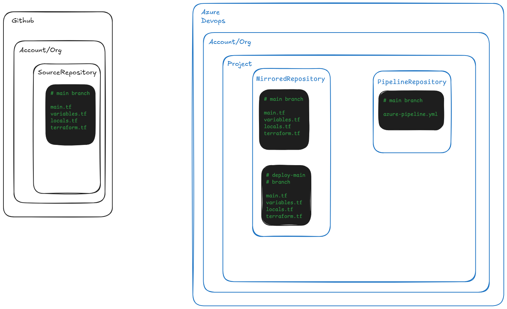

# Mirroring Github Repository to Azure DevOps Repository

## Introduction 
This sample code uses an Azure DevOps pipeline to mirror a Github repository to an Azure Devops repository.
Each execution of this pipeline will create a pull request against the mirrored repository in Azure DevOps.
The contributors of the Azure DevOps repository can review the code changes and approve merging the pull request with current state of the mirrored Azure DevOps repository.



## Getting Started

Requirements:

1. This [repository](https://github.com/vbalbarin/MirrorGitHubToAzureDevops)
2. Azure Devops organization
    * Target repository
    * Pipeline repository
3. A GitHub repository that will be mirrored into your Azure DevOps repository.

Setup:

1. Create an Azure DevOps organization.
2. Create a new project `<ado_project_name>`.
3. Create a new repository named `MirrorGitHubToAzureDevops` in the this project.
4. Import this GitHub [repository](https://github.com/vbalbarin/MirrorGitHubToAzureDevops) into the AzureDevops repository `MirrorGitHubToAzureDevops`.
5. Create a new repository to hold the mirrored GH repository `<name_of_ado_repo_mirrored_from_ghb_repo>`.
6. Import GitHub repository into the AzureDevops repository `<name_of_ado_repo_mirrored_from_ghb_repo>`.
7. Grant the `<ado_project_name> Build Service` user the appropriate privileges against `<name_of_ado_repo_mirrored_from_ghb_repo>`.
   1. Select **Project Settings →  Repositories → <name_of_ado_repo_mirrored_from_ghb_repo → Security → Users → <ado_project_name> Build Service>**
   2. Allow **Contribute**, **Contribute to pull requests**, and **Create branch**.

Optional: Create a managed DevOps pool and user managed identity assigned to it in your Azure subscription.

Execution:

1. Edit pipeline and assign values to variables

```bash
MANAGED_DEVPOOL='' # Leave empty to use parallel default msft hosted ubuntu-latest
IMAGE_NAME='' # name of msft hosted image to use; defaults to ubuntu-latest
ADO_TARGET_REPO='azure_devops_repo_git_uri' # git URI domain, minus git: scheme
GHB_SOURCE_REPO='github_repo_uri' # https URI domain, minus https: scheme
USER_EMAIL='projbuildservice@domain.local'
USER_NAME='projbuildservice'
```

2. Run pipeline to mirror.

## Appendix

```bash
az extension add --name azure-devops

repo='MirrorGitHubToAzureDevops'
project='<name_of_project>'
org='<url_of_devops_org>'

az repos create --org "${org}" --project "${project}" --name "${repo}"
```